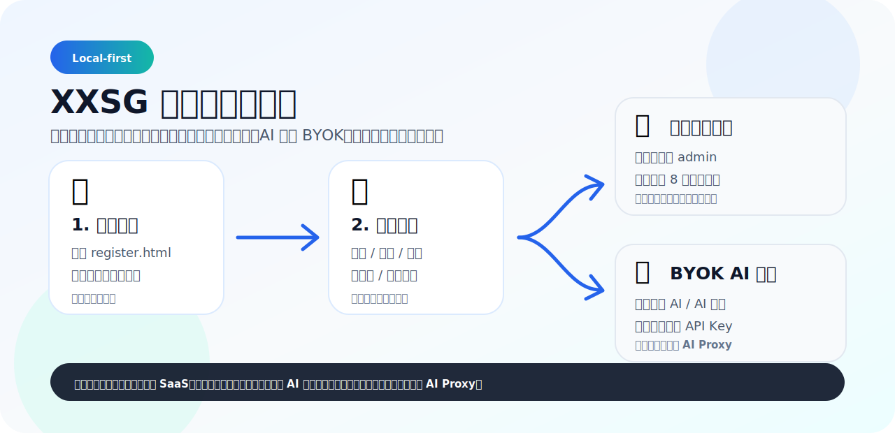
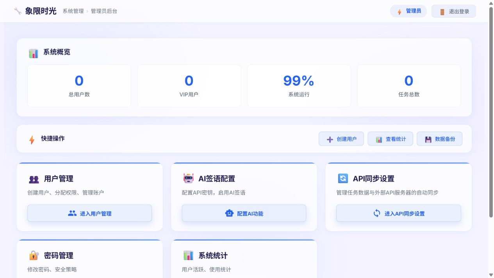

# XXSG（象限时光）

[](https://github.com/wangyuanhao666/XXSG-OpenSource/actions/workflows/ci.yml)
[](LICENSE)
[](#重要安全说明)
[](#ai-功能采用-byok-模式)

XXSG 是一个本地优先的个人生产力 PWA，围绕四象限任务管理，提供任务、日历、习惯打卡、番茄钟、时间统计、每日一签和 AI 辅助能力。

> 当前开源版本定位为“本地优先 / 自托管 / BYOK（Bring Your Own Key）”。  
> 它不是完整的公网多人 SaaS：用户、任务、设置和 AI 配置默认保存在浏览器本地存储中。

## 快速开始

| 场景 | 入口 | 你需要知道 |
| --- | --- | --- |
| 直接体验 | [在线演示](https://wangyuanhao666.github.io/XXSG-OpenSource/) | 打开后可本地注册账号，不需要联系作者。 |
| 创建普通账号 | [register.html](https://wangyuanhao666.github.io/XXSG-OpenSource/register.html) | 账号只保存在当前浏览器本地。 |
| 已有账号登录 | [login.html](https://wangyuanhao666.github.io/XXSG-OpenSource/login.html) | 换浏览器或清缓存前请先导出备份。 |
| 初始化管理员 | `login.html` → 管理员后台登录 | 管理员账号固定为 `admin`，首次输入任意 8 位以上密码完成本地初始化。 |
| 使用 AI 功能 | 管理员后台 → AI 配置 | 每日一签 AI 和 AI 任务分析共用 AI 服务配置，支持 DeepSeek / OpenAI / Claude / Kimi / 通义千问 / GLM/Z.ai / MiniMax。公网多人统一 AI 需要后端 AI Proxy。 |



## 功能亮点

- 四象限任务管理：任务分类、子任务、置顶、拖拽排序、列表/象限视图切换。
- 日历日程：日历事件管理，并支持从任务同步到日历。
- 习惯打卡：日历式打卡、连续天数和趋势统计。
- 番茄钟：自定义专注/休息时长、音效和历史记录。
- 数据看板：任务数量、完成率、象限分布等统计。
- 每日一签：传统签文无需 API Key；AI 签文需要在管理员后台配置任一支持的 AI 服务 API Key。
- AI 辅助：任务分析、智能建议等能力，需要在管理员后台配置 DeepSeek、OpenAI、Claude、Kimi、通义千问、GLM 或 MiniMax API Key。
- 数据导入/导出：用于本地备份和迁移。

## 预览

管理后台预览：



## 在线体验

你可以直接打开 GitHub Pages 演示站：

[https://wangyuanhao666.github.io/XXSG-OpenSource/](https://wangyuanhao666.github.io/XXSG-OpenSource/)

首次打开时无需联系作者获取账号：

1. 在登录页点击“本地注册 / 创建账号”，进入独立注册页。
2. 创建当前浏览器可用的本地账号。
3. 注册成功后会自动进入应用。

更多入口：

| 你想做什么 | 入口 | 说明 |
| --- | --- | --- |
| 直接体验普通用户功能 | [`register.html`](https://wangyuanhao666.github.io/XXSG-OpenSource/register.html) | 创建当前浏览器本地账号，注册后自动进入应用。 |
| 已有本地账号登录 | [`login.html`](https://wangyuanhao666.github.io/XXSG-OpenSource/login.html) | 使用你在当前浏览器创建过的本地账号登录。 |
| 初始化本地管理员 | [`login.html`](https://wangyuanhao666.github.io/XXSG-OpenSource/login.html) → 管理员后台登录 | 管理员账号固定为 `admin`；首次输入任意 8 位以上密码会完成当前浏览器初始化。 |
| 配置 AI 功能 | 管理员后台 | 每日一签 AI 和 AI 任务分析支持 DeepSeek / OpenAI / Claude / Kimi / 通义千问 / GLM/Z.ai / MiniMax。均采用 BYOK，需要自行配置 API Key。 |

注意：演示站和自托管静态站默认都是本地优先模式，账号、任务和设置保存在你自己的浏览器里，不是作者维护的云端账号。

## 在线部署

你可以直接 fork 或 clone 后部署到静态托管平台：

[](https://vercel.com/new/clone?repository-url=https://github.com/wangyuanhao666/XXSG-OpenSource)

[](https://app.netlify.com/start/deploy?repository=https://github.com/wangyuanhao666/XXSG-OpenSource)

GitHub Pages 也可以部署，详见 [部署指南](docs/DEPLOYMENT.md)。

## 本地运行

```bash
git clone https://github.com/wangyuanhao666/XXSG-OpenSource.git
cd XXSG-OpenSource
npm install
npm run serve
```

然后访问：

```text
http://localhost:8080
```

首次使用请看：[首次使用指南](docs/FIRST_USE.md)。

## 重要安全说明

### 本项目默认不提供云端账号系统

当前版本主要依赖浏览器本地存储。换浏览器、清理缓存或更换设备前，请先导出备份。

如果你需要公网多人注册、统一登录、跨设备同步、管理员服务端鉴权，请参考 [SaaS 后端路线图](docs/saas-backend-roadmap.md)，先接入后端认证和数据库。

### AI 功能采用 BYOK 模式

每日一签 AI 和 AI 任务分析需要在管理员后台配置第三方模型 API Key。当前本地优先版本中，API Key 会保存在部署者/使用者自己的浏览器侧存储中。

当前开源版支持的 API Key：

| 功能 | 当前支持的 API Key | 默认接口 / 模型 |
| --- | --- | --- |
| 每日一签 AI 签文 | 任一支持的 AI 服务 API Key | 支持 DeepSeek、OpenAI、Claude、Kimi、通义千问、GLM/Z.ai、MiniMax |
| AI 任务分析 / 智能建议 | 任一支持的 AI 服务 API Key | 支持 DeepSeek、OpenAI、Claude、Kimi、通义千问、GLM/Z.ai、MiniMax |
| AI 任务分析 / 智能建议 | OpenAI API Key | `https://api.openai.com/v1/chat/completions`，`gpt-3.5-turbo` |
| AI 任务分析 / 智能建议 | Claude / Anthropic API Key | `https://api.anthropic.com/v1/messages`，`claude-sonnet-4-5` |
| AI 任务分析 / 智能建议 | Kimi / Moonshot API Key | `https://api.moonshot.cn/v1/chat/completions`，`kimi-k2.6` |
| AI 任务分析 / 智能建议 | 通义千问 / DashScope API Key | `https://dashscope.aliyuncs.com/compatible-mode/v1/chat/completions`，`qwen-plus` |
| AI 任务分析 / 智能建议 | GLM / Z.ai API Key | `https://api.z.ai/api/paas/v4/chat/completions`，`glm-4.5-flash` |
| AI 任务分析 / 智能建议 | MiniMax API Key | `https://api.minimax.io/v1/chat/completions`，`MiniMax-M3` |

配置路径：登录管理员后台 → AI 配置 → 选择服务商 → 填写对应 API Key → 保存并启用。

请不要把你自己的 API Key 写进源码，也不要把配置后的浏览器数据导出给他人。

如果你要给公网用户统一提供 AI 能力，请先实现服务端 AI Proxy，把模型供应商 Key 放在服务器环境变量里，并增加鉴权、限流和额度控制。

### 管理员密码由部署者初始化

开源版本不内置公开默认管理员密码。普通用户可以直接在登录页自助创建本地账号。

如果你需要进入本地管理员后台，请使用管理员账号 `admin` 登录，并输入至少 8 位密码完成当前浏览器的管理员初始化。这个密码由你自己设置，项目源码里不会保存公开默认密码。

这个管理员机制仍然属于本地前端管理，适合个人/自托管使用，不等同于服务端安全管理员系统。

## 项目结构

```text
.
├── index.html                 # 主应用入口
├── login.html                 # 登录/本地管理员初始化入口
├── admin.html                 # 本地管理员后台
├── js/                        # 主要前端逻辑
├── css/                       # 页面样式
├── partials/                  # 功能视图片段
├── api/                       # 可选 Vercel Serverless 示例
├── docs/                      # 使用、部署和路线图文档
├── tools/                     # 检查脚本
├── sw.js                      # PWA Service Worker
└── manifest.json              # PWA Manifest
```

## 开发检查

```bash
npm run check
npm run audit:project
```

CI 会在 GitHub Actions 中运行同样的检查。

## 路线图

- 第一阶段：安全开源本地版，明确本地优先和 BYOK 边界。
- 第二阶段：增加可选后端同步适配器。
- 第三阶段：服务端认证、数据库、多租户权限和 AI Proxy。
- 第四阶段：面向公网用户的 SaaS 化部署。

## 参与贡献

欢迎 issue、文档改进、UI 优化和功能 PR。开始前请阅读：

- [贡献指南](CONTRIBUTING.md)
- [安全策略](SECURITY.md)

## License

MIT License. See [LICENSE](LICENSE).
